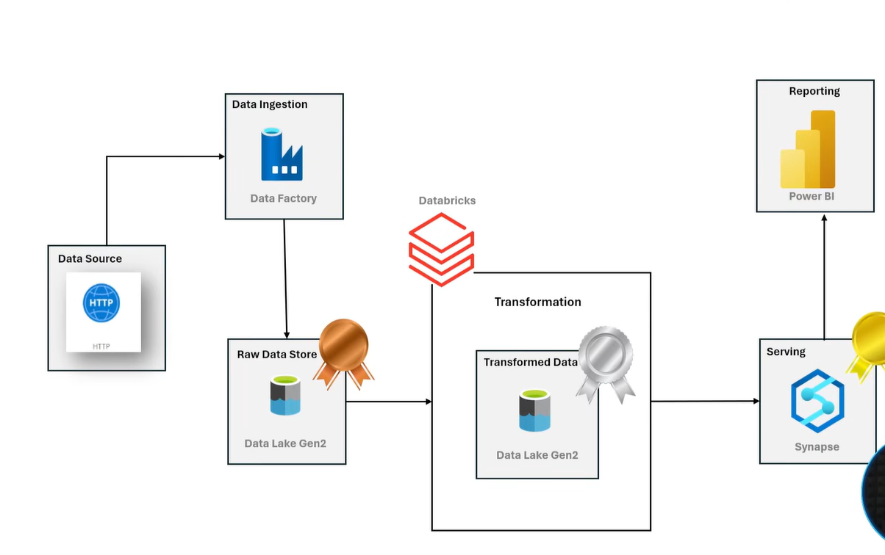

# Adventure-Works-Data-Engineering-project
A comprehensive guide to an End-to-End Data Engineering project from scratch, leveraging powerful technologies like Azure Data Factory, Azure Data Lake, Databricks, Azure Synapse Analytics, and Apache Spark.
## Overview
This repository showcases an End-to-End Data Engineering project from scratch. It leverages powerful technologies like Azure Data Factory, Azure Data Lake, Databricks, Azure Synapse Analytics, and Apache Spark.

## Architecture

## Technologies Used
  1. Programming Language - Python
  2. Scripting Language - SQL
  3. Azure Cloud Platform
     - **Azure Data Factory**: For orchestrating data workflows.
     - **Azure Data Lake**: For scalable data storage.
     - **Databricks**: For collaborative data processing and analytics.
     - **Azure Synapse Analytics**: For integrated data analytics.
     - **Apache Spark**: For large-scale data processing.
  4. Power BI

 ## Dataset Used
 The AdventureWorks dataset is a comprehensive sample database provided by Microsoft. It is designed to showcase the design and 
 functionality of a SQL Server database. The dataset includes a variety of data models and scenarios, making it ideal for learning and 
 demonstrating database concepts and features.
 [Adventure Works ](https://www.kaggle.com/datasets/ukveteran/adventure-works).
 
 ## Scripts for Project
  1.[Dynamic Pipeline ADF](Dynamic_Pipeline_ADF.json).
  2.[Tranformations and Analysis](Silver_Layer_Transformations&Analaysis.ipynb).
  3.[Views](Create ).

